# Python IDE based Neovim + NvChad

Autumn, 2025

## Abstracts

Руководство по сборке Python IDE на базе текстового редактора Neovim и набора конфигураций NvChad для Linux-пользователей.
Предствляет собой синтез документации NvChad и Neovim, личного опыта и разнообразных сторонних мануалов и гайдов по этой или смежной темам.
Ссылки на все источники или просто полезные ресурсы находятся в разделе Bibliography.

## Table of Contents

- [Directory structure](#Directory-structure)
- [How to use this document](#How-to-use-this-document)
- [Part 1: Installing and configuring NvChad](<>)
  - [Installing NvChad](#Installing-NvChad)
  - [Default plugins](#Default-plugins)
  - [Configuring NvChad](#Configuring-NvChad)
- [Part 2: Installing developer tooling](<>)
  - [Treesitter](#Treesitter)
  - [LSP-server](#LSP-server)
  - [Linters Ruff](#Linters-ruff)
    - [Install ruff](<>)
    - [Use ruff](<>)
    - [Configure ruff](<>)
  - [Formatter Black](#Formatter-black)
    - [Install black](<>)
    - [Use black](<>)
    - [Configure black](<>)
- [Part 3: Debugger](#Debugger)
  - [Main info](#Main-info)
  - [Configuration](#Configuration)
  - [How to debug Django/Flask](#How-to-debug)
- [Part 4: Pre-commit pipeline](<>)
- [Part 5: Additional tools](<>)
  - [Notifications](<>)
  - [Git](<>)
  - [Markdown](<>)
- [Bibliography](#Bibliography)
- [Annex A: How autocompletion works](#Annex-A)
- [Annex B: Tree-sitter](#Annex-B)
- [Annex C: How LSP works](#Annex-C)
- [Annex D: jedi vs pyright](#Annex-D)
- [Annex E: Debugging](#Annex-E)
- [Tips and tricks](#Tips-and-tricks)
  - [LSP messages](#LSP-messages)

## Directory structure

```
nvim-python-ide
.
├──   tooling/
├──   basics/
├──   configs/
├──   images/
├──   python-project-configs/
└──   README.md
```

**tooling**\
Документация по используемому набору инструментов разработчика

**basics**\
Прочие документы

**configs**\
Мои конфигурации (из директории ~/.config/nvim/) с подробными комментариями

**images**\
Используемые изображения (svg, png)

**python-project-configs**\
Мои конфигурационные файлы pyproject.toml и .pre-commit-config.yaml

## How to use this document

**Из каких этапов состоит сборка Neovim в качестве Python IDE и какие для них характеры особенности**

> [!WARNING]
> Материал находится в процессе написания

Читать и делать последовательно - так как это представлено в документе.
Эффективнее всего будет использовать мой мануал в совокупности с документацей NvChad, Lazy и соответствующих плагинов.

Документ содержит приложения (Annexes) с иллюстрациями или простыми пояснениями того, что я счел важным обозреть подробнее.

Директория basics возможно будет содержать какие-нибудь дополнительные документы, например о том, что такое IDE и что такое редактор кода.

______________________________________________________________________

## Part 1: Installing and configuring NvChad

### Installing NvChad

**Шаг первый:**
Первичная установка NvChad проста - достаточно следовать инструкциям в документации на веб-сайте NvChad:

- Удалить все остальные текущие конфигурации и плагины Neovim
- Проверить, что установлена совместимая (современная) версия Neovim
- Убедиться, что установлен Ripgrep (чтобы работал поиск в Telescope)
- Убедиться, что установлена актуальная версия GCC

**Шаг второй:**
Непосредственно установка NvChad выполняется командой:

```bash
git clone https://github.com/NvChad/starter ~/.config/nvim && nvim
```

> [!NOTE]
>
> Mason - это менеджер пакетов для Neovim.\
> С его помощью мы можем управлять lsp-серверами, линтерами, форматтерами и дебаггерами.

Внимание! Следующим шагом документация NvChad рекомендует выполнить в командном режиме:

```
:MasonInstallAll.
```

**Но мы сделаем это чуточку позже - иначе все пойдет не так, как мы ожидаем и это изъян документации NvChad.**

**Шаг третий:**
Перезапустим(!) Neovim и выполним в командном режиме:

```
:checkhealth 
```

Для того, чтобы убедится что все прошло нормально.

> [!NOTE]
>
> Ошибки с luarocks бояться не стоит - он скорее всего нам не потребуется вовсе

После установки файлы окажутся распределены про трем разным директориям:

```
.
├──   ~/.config/nvim/
├──   ~/.local/share/nvim/ 
└──   ~/.local/state/nvim/
```

**~/.config/nvim**\
Содержит пользовательские конфигурации

**~/.local/share/nvim/**\
Содержит установленные с помощью Lazy и Mason плагины

**~/.local/state/nvim/**\
содержит файлы состояния (история, undo, swap, логи)

В основном мы будем работать только в директории ~/.config/nvim, про остальные достаточно просто знать.

**Далее, есть один интересный момент:**
Чтобы lsp-сервера lua-language-server, css-lsp, html-lsp и lua-formatter stylua у нас установились автоматически,
нам нужно открыть какой-нибудь lua-файл в Neovim (например, init.lua в директории ~/.config/nvim) и **только после этого выполнить в командном режиме:**

```
:MasonInstallAll
```

После чего, согласно руководству на сайте NvChad, нам необходимо переместиться в директорию ~/.config/nvim/ и удалить в ней поддиректорию .git.

### Default plugins

NvChad использует в качестве менеджера плагинов Lazy и поставляется с набором предустановленных плагинов.
Чтобы просмотреть какие плагины предустановлены выполним :Lazy.

> [!NOTE]
>
> Основной особенностью Lazy является lazy loading - настраиваемая загрузка плагинов по мере необходимости.\
> Поэтому мы увидим, что все плагины разделены на два списка:
>
> 1. Loaded - установленные и загруженные плагины
> 1. Not Loaded - установленные, но не загруженные плагины

Ниже приведены таблицы, где все предустановленные плагины разбиты на категории.

**NvChad плагины**
| Плагин | Описание |
| ---------------- | ------------------------------------------------------------ |
| `nvchad/base46` | Темы и конфигурации UI для NvChad |
| `nvchad/ui` | Пользовательский интерфейс NvChad (статусная строка, таб-линия и др.) |
| `nvzone/menu` | Контекстное меню в NvChad |

**Плагины для автодополнения**\
*Как работает автодополнение см. [Annex A](#Annex-A)*

| Плагин | Описание |
| ---------------------------------------------------- | --------------------------------------------------- |
| `hrsh7th/nvim-cmp` | Completion engine plugin |
| `L3MON4D3/LuaSnip` | Snippet engine plugin, written in Lua |
| `windwp/nvim-autopairs` | Автоматически вставляет парные символы: `()`, `[]`, `""`, etc |
| `saadparwaiz1/cmp_luasnip` | Source adapter для snippets (LuaSnip) |
| `hrsh7th/cmp-nvim-lua` | Source adapter: Neovim → LSP-server for Lua |
| `hrsh7th/cmp-nvim-lsp` | Source adapter: Neovim → LSP-server for other langs |
| `hrsh7th/cmp-buffer` | Source adapter из текущего буфера |
| `https://codeberg.org/FelipeLema/cmp-async-path.git` | Source adapter для путей (async path) |
| `rafamadriz/friendly-snippets` | Коллекция готовых сниппетов для разных языков (используется с LuaSnip) |

**User Interface плагины**
| Плагин | Описание |
| ------------------------------- | ------------------------------------------------------------ |
| `nvzone/volt` | Инструмент для управления цветовыми схемами |
| `nvzone/minty` | Ещё один инструмент тем (альтернатива Volt) |
| `nvim-tree/nvim-web-devicons` | Иконки для файлов в Neovim |
| `lukas-reineke/indent-blankline.nvim` | Подсветка отступов для лучшей читаемости |
| `lewis6991/gitsigns.nvim` | Значки Git на полях (добавлено, изменено и т. д.) |
| `folke/which-key.nvim` | Подсказки по горячим клавишам |

**Tooling**
| Плагин | Описание |
| ------------------------------------ | ------------------------------------------------------------ |
| `nvim-tree/nvim-tree.lua` | Файловый менеджер |
| `stevearc/conform.nvim` | Автоматическое форматирование кода |
| `mason-org/mason.nvim` | Менеджер для установки LSP, линтеров и т. д. |
| `folke/lazy.nvim` | Менеджер плагинов для Neovim |
| `neovim/nvim-lspconfig` | Настройки LSP (Language Server Protocol) |
| `nvim-telescope/telescope.nvim` | Поиск файлов, текста и др. |
| `nvim-treesitter/nvim-treesitter` | Улучшенный синтаксический анализ и подсветка |

**Other**
| Плагин | Описание |
| ---------------- | ------------------------------------------------------------ |
| `plenary.nvim` | Библиотека для Lua, нужна для работы других плагинов |

### Configuring NvChad

Следующим этапом будет написание конфигурации в файле **~/.config/nvim/lua/chadrc.lua**.\
Для получения подробной справки по написанию конфигурации в этом файле нужно выполнить в командном режиме:

```
:h nvui
```

**В chadrc.lua обычно конфигурируется:**

- Цветовая схема (base46)
- Элементы User Interface:
  - Стиль окна автодополнения (cmp)
  - Стиль окна Telescope
  - Стиль statusline
  - Стиль tabufline
- Плавающее окно терминала (term)
- Приветственное окно Neovim (nvdash)
- Стиль cheatsheat
- Настройки плагина colorify.nvim, который показывает образцы цветов в буфере
- Mason: пакеты для установки по умолчанию
- *некоторые аспекты поведения lsp*

Вприницпе, справка :h nvui дает исчерпывающую информацию по возможностям конфигурации.\
Пример моей **подробно откомментированной конфигурации** можно найти в директории **configs/chadrc.lua**.

**Чем отличается hl_override и hl_add?**\
В hl\_ мы конфигурируем стили для различных элементов интерфейса.\
Все доступные для переопределения элементы можно изучить выполнив:

```
:help highlight-groups - список стандартных групп
:hi - посмотреть текущие группы и их стили
```

hl_override - полностью переопределяет текущие стили для соответствующих элементов.
hl_add - добавляет указанные в этой таблице стили к текущим.

После всех выполненных выше действий, согласно документации NvChad, необходимо выполнить:

```
:Lazy sync
```

______________________________________________________________________

## Part 2: Installing developer tooling

### Treesitter

> [!NOTE]
>
> Из-за lazy loading плагин nvim-treesitter не будет загружен до тех пор,
> пока он не потребуется. Поэтому, прежде чем командовать nvim-treesitter'ом
> нужно открыть какой-нибудь файл (или изменить конфигурацию lazy loading для nvim-treesitter)

В NvChad используется плагин nvim-treesitter для подстветки синтаксиса.

*Как именно это работает можно посмотреть в [Annex B](#Annex-B)*

Для корректной работы nvim-treesitter необходимо установить парсер для конкретного языка.
Мы можем узнать какие парсеры у нас уже установлены выполнив в командном режиме :TSInstallInfo

Парсер для языка Python не предустановлен и далее у нас есть два возможных пути:

**1. Внести изменения в конфигурационный файл (предпочтительно)**\
В файле ~/.config/lua/plugins/init.lua нужно раскомментировать следующий блок кода и добавить туда "python":

```lua
  {
  	"nvim-treesitter/nvim-treesitter",
  	opts = {
  		ensure_installed = {
  			"vim", "lua", "vimdoc",
       "html", "css", "python" -- добавили
  		},
  	},
  },

```

А так же все остальное, что душе угодно.\
После чего перезапустить Neovim.

Этот вариант предпочтительней, потому как обеспечивает лучший контроль и переносимость конфигурации при необходимости.

**2. Руками установить парсер для Python**\
Для этого нужно просто выполнить в командном режиме :TSInstall python.\
Далее, для корректной работы nvim-treesitter c Python следует перезапустить Neovim.

### LSP-server

*Что такое LSP-сервер и как это работает можно посмотреть в [Annex C](#Annex-C)*

Чтобы получить справку по LSP от плагина nvim-lspconfig:

```
:help lspconfig 
:help lspconfig-all 
```

В Mason, во вкладке LSP, доступно достаточно много LSP-серверов в комментарии к которым указан Python.\
Мы рассмотрим только два из них: jedi-language-server и pyright.

#### Установка:

**Способ 1 (предпочтительный)**:\
Добавить jedi-language-server и/или pyright в chadrc.lua

```lua
M.mason = {
  -- список lsp-серверов, линтеров и форматтеров, которые нужно установить
  pkgs = {
    "jedi-language-server",
    "pyright",
  }
  -- список тех, что нужно исключить
  -- skip = {}
}
```

После этого выполнить:

```
:MasonInstallAll
```

**Способ 2 (вручную)**:

```
:MasonInstall pyright
:MasonInstall jedi-language-server
```

#### Подключение

**Способ 1**:\
Простой, без конфигурации.\
В файле lspconfig.lua:

```lua
require("nvchad.configs.lspconfig").defaults()

local servers = { "html", "cssls", "jedi-language-server" -- или pyright }
vim.lsp.enable(servers)
```

**Способ 2**:\
Когда необходимо прописать конфигурацию для lsp-сервера.\
В файле lspconfig.lua:

```lua
local servers = {
  html = {},
  awk_ls = {},
  bashls = {},

  pyright = {
    settings = {
      python = {
        analysis = {
          autoSearchPaths = true,
          typeCheckingMode = "basic",
        },
      },
    },
  },
}

for name, opts in pairs(servers) do
  vim.lsp.enable(name)  -- nvim v0.11.0 or above required
  vim.lsp.config(name, opts) -- nvim v0.11.0 or above required
end
```

#### Краткий обзор

**jedi-language-server**\
Это минималистичный python lsp-server, главным образом ориентированный на автодополение.

**pyright**\
Это мощный и тонко настраиваемый python lsp-server от microsoft.

*Краткое сравнение jedi и pyright можно посмотреть в [Annex D](#Annex-D)*

### Linters ruff

**Ruff**\
Это инструмент для статического анализа кода.\
Он включает в себя множество линтеров, которые мы можем подключать и отключать по мере необходимости.

*Краткий обзор всех доступных по умолчанию линтеров можно посмотреть в tooling/ruff/readme.md*

#### Install ruff

Чтобы установить ruff нужно добавить его в chadrc.lua:

```lua
M.mason = {
  -- список lsp-серверов, линтеров и форматтеров, которые нужно установить
  pkgs = {
    "...", -- уже добавленные программы
    "ruff",
  }
}
```

И выполнить:

```
:MasonInstallAll
```

#### Use ruff

Использовать ruff можно двумя способами.

1. Подключить ruff как lsp-server:
   *Тогда сообщения от линтеров будут выводиться прямо в neovim.*

Для этого в файле lspconfig.lua необходимо добавить соответствующую запись:

```lua
local servers = {
  -- ...
  ruff = {},
}

for name, opts in pairs(servers) do
  vim.lsp.enable(name)  -- nvim v0.11.0 or above required
  vim.lsp.config(name, opts) -- nvim v0.11.0 or above required
end
```

2. Использовать ruff в эмуляторе терминала при помощи соотвествующих команд.

Важно отметить, что если активно виртуальное окружение, то для того, чтобы можно было вызывать ruff в командной оболочке придется установить его в виртуальное окружение.

#### Configure ruff

pyproject.toml

### Formatter black

**Black**\\

Это классический formatter для python-кода.\
Зачем использовать black, если ruff тоже умеет форматировать код?

#### Install black

Чтобы установить black нужно добавить его в chadrc.lua:

```lua
M.mason = {
  -- список lsp-серверов, линтеров и форматтеров, которые нужно установить
  pkgs = {
    "...", -- уже добавленные программы
    "black",
  }
}
```

И выполнить:

```
:MasonInstallAll
```

#### Use black

Чтобы начать использовать black нужно добавить соответствующую конфигурацию в файл conform.lua:

```lua
local options = {
  formatters_by_ft = {
    lua = { "stylua" },
    python = { "black" },
    -- css = { "prettier" },
    -- html = { "prettier" },
  },

  -- format_on_save = {
  --   -- These options will be passed to conform.format()
  --   timeout_ms = 500,
  --   lsp_fallback = true,
  -- },
}
```

Далее, сделаем так, чтобы lazy загружал плагин conform.nvim при открытии любого python файла.
Для этого добавим *ft = python* в plugins/init.lua:

```lua
{
"stevearc/conform.nvim",
-- event = 'BufWritePre', -- uncomment for format on save
opts = require "configs.conform",
-- загрузить conform если открываем python файл 
ft = "python",
},
```

Мы можем делать форматирование тремя разными способами:

1. Автоматическое форматирование при сохранении файла.
   *Для этого нужно просто раскомментировать format_on_save:*

```lua
local options = {
  formatters_by_ft = {
    lua = { "stylua" },
    python = { "black" },
    -- css = { "prettier" },
    -- html = { "prettier" },
  },

  format_on_save = {
    -- These options will be passed to conform.format()
    timeout_ms = 500,
    lsp_fallback = true,
  },
}
```

2. Форматирование командой.
   *Для этого в файл conform.lua нужно добавить следующий код:*

```lua
-- from conform plugin github page recipes
vim.api.nvim_create_user_command("ConformFormat", function(args)
  local range = nil
  if args.count ~= -1 then
    local end_line = vim.api.nvim_buf_get_lines(0, args.line2 - 1, args.line2, true)[1]
    range = {
      start = { args.line1, 0 },
      ["end"] = { args.line2, end_line:len() },
    }
  end
  require("conform").format({ async = true, lsp_format = "fallback", range = range })
end, { range = true })
```

После этого форматирование будет доступно по команде:

```
:ConformFormat
```

3. Добавить комбинацию клавиш для форматирования.
   *Для этого нужно написать в mappings.lua следующую конфигурацию:*

```lua
-- romz987 conform format buffer 
map("n", "<leader>fb", function()
  vim.cmd("ConformFormat")
end, { desc = "Format buffer with conform" })
```

Теперь форматирование будет доступно нажатием последовательно пробел - f - b\
Соответствующую запись можно будет увидеть в окне which-key.nvim.

#### Configure black

pyproject.toml

______________________________________________________________________

## Part 3: Debugger

### Main info

Для отладки Python-кода в Neovim требуется установка следующих плагинов:

- nvim-dap
- nvim-dap-ui
- nvim-dap-virtual-text
- nvim-dap-nio
- nvim-dap-python

*Подробнее о том, как работает процесс отладки в Neovim можно узнать в [Annex E](#Annex-E)*

Список необходимых для установки плагинов, параметры их конфигурации и hotkeys необходимо написать в plugins/init.lua.\
Но это еще не все - правильнее всего будет вынести параметры конфигурации и hotkeys в отдельные файлы.\
Сделать это можно по разному, но я предлагаю следующую структуру директории plugins:

```
plugins
.
├──  init.lua
└──  nvim-dap
    ├──  nvim-dap-keys.lua
    ├──  nvim-dap-python
    │   └──  nvim-dap-python-keys.lua
    └──  nvim-dap-ui
        ├──  nvim-dap-ui-config.lua
        └──  nvim-dap-ui-keys.lua
```

**nvim-dap-keys.lua**\
Горячие клавиши для управления nvim-dap.

**nvim-dap-python-keys.lua**\
Горячие клавиши для управления nvim-dap-python.\
(Отладка классов и методов)

**nvim-dap-ui-config.lua**\
Конфигурация для nvim-dap-ui

**nvim-dap-ui-keys.lua**\
Горячик клавиши для управления nvim-dap-ui:

- открыть/закрыть интерфейс nvim-dap-ui
- выполнить eval

### Configuration

> [!NOTE]
> Хорошо откомментированный код представленных ниже конфигураций можно найти в директории configs/plugins

**Файл plugins/init.lua**

```lua
  {
    "mfussenegger/nvim-dap",
    ft = "python",
    dependencies = {
      {
        "rcarriga/nvim-dap-ui",
        opts = {},
        keys = require("plugins.nvim-dap.nvim-dap-ui.nvim-dap-ui-keys").keys,
        dependencies = { "nvim-neotest/nvim-nio" },
        config = function (_, opts)
          require("plugins.nvim-dap.nvim-dap-ui.nvim-dap-ui-config").setup(opts)
        end,
      },
      {
        "theHamsta/nvim-dap-virtual-text",
        opts = {},
      },
    },

    keys = require("plugins.nvim-dap.nvim-dap-keys").keys,

    config = function ()
      vim.api.nvim_set_hl(0, "DapStoppedLine", { default = true, link = "Visual" })
      local vscode = require("dap.ext.vscode")
      local json = require("plenary.json")
      vscode.json_decode = function(str)
        return vim.json.decode(json.json_strip_comments(str))
      end
    end,
  },

  {
    "mfussenegger/nvim-dap-python",
    ft = "python",
    keys = require("plugins.nvim-dap.nvim-dap-python.nvim-dap-python-keys").keys,

    config = function ()
      local python_path = vim.fn.stdpath("data") .. "/mason/packages/debugpy/venv/bin/python"
      require("dap-python").setup(python_path)
    end,
  },

  {
    "MeanderingProgrammer/render-markdown.nvim",
       dependencies = { 'nvim-treesitter/nvim-treesitter', 'nvim-tree/nvim-web-devicons' },
       ft = "markdown",
    ---@module 'render-markdown'
    opts = {},
  },
```

**Файл nvim-dap/nvim-dap-keys.lua**

```lua
local M = {}

M.keys = {
    { "<leader>dB", function() require("dap").set_breakpoint(vim.fn.input('Breakpoint condition: ')) end, desc = "Breakpoint Condition" },
    { "<leader>db", function() require("dap").toggle_breakpoint() end, desc = "Toggle Breakpoint" },
    { "<leader>dc", function() require("dap").continue() end, desc = "Run/Continue" },
    { "<leader>dC", function() require("dap").run_to_cursor() end, desc = "Run to Cursor" },
    { "<leader>dg", function() require("dap").goto_() end, desc = "Go to Line (No Execute)" },
    { "<leader>di", function() require("dap").step_into() end, desc = "Step Into" },
    { "<leader>dj", function() require("dap").down() end, desc = "Down" },
    { "<leader>dk", function() require("dap").up() end, desc = "Up" },
    { "<leader>dl", function() require("dap").run_last() end, desc = "Run Last" },
    { "<leader>do", function() require("dap").step_out() end, desc = "Step Out" },
    { "<leader>dO", function() require("dap").step_over() end, desc = "Step Over" },
    { "<leader>dP", function() require("dap").pause() end, desc = "Pause" },
    { "<leader>dr", function() require("dap").repl.toggle() end, desc = "Toggle REPL" },
    { "<leader>ds", function() require("dap").session() end, desc = "Session" },
    { "<leader>dt", function() require("dap").terminate() end, desc = "Terminate" },
    { "<leader>dw", function() require("dap.ui.widgets").hover() end, desc = "Widgets" },
}

return M
```

**Файл nvim-dap/nvim-dap-python/nvim-dap-python-keys.lua**

```lua
local M = {}

M.keys = {
      { "<leader>dPt", function() require('dap-python').test_method() end, desc = "Debug Method", ft = "python" },
      { "<leader>dPc", function() require('dap-python').test_class() end, desc = "Debug Class", ft = "python" }
}

return M
```

**Файл nvim-dap/nvim-dap-ui/nvim-dap-ui-keys**

```lua
local M = {}

M.keys = {
    { "<leader>du", function() require("dapui").toggle({ }) end, desc = "Dap UI" },
    { "<leader>de", function() require("dapui").eval() end, desc = "Eval", mode = {"n", "v"} },
}

return M

```

**Файл nvim-dap/nvim-dap-ui/nvim-dap-ui-config**

```lua
local M = {}

function M.setup(opts)
    local dap = require("dap")

    dap.adapters.python = {
        type = 'executable';
        command = 'python';
        args = { '-m', 'debugpy.adapter' };
    }

    dap.configurations.python = {
        {
            type = 'python';
            request = 'launch';
            name = 'Start Django debugging';
            program = '/path/to/django/manage.py';
            args = {'runserver'};
            console = 'integratedTerminal';
            justMyCode = true;
        },
    }

    local dapui = require("dapui")
    dapui.setup(opts)
    dap.listeners.after.event_initialized["dapui_config"] = function()
        dapui.open({})
    end
    dap.listeners.before.event_terminated["dapui_config"] = function()
        dapui.close({})
    end
    dap.listeners.before.event_exited["dapui_config"] = function()
        dapui.close({})
    end
    vim.fn.sign_define('DapBreakpoint', {text='⬤', texthl='DapBreakpoint', linehl='', numhl=''})
    vim.cmd('highlight DapBreakpoint guifg=#FF0000 ctermfg=red')
end

return M
```

### How to debug

**Django/Flask**

Для того, чтобы отлаживать приложения на Django или Flask необходимо в файле **nvim-dap-ui-config** прописать
путь до файла run.py приложения в случае Flask и файла manage.py в случае Django.\
В случае Flask **args ={};** нужно оставить пустым.

Flask

```lua
dap.configurations.python = {
    {
        type = 'python';
        request = 'launch';
        name = 'Start Flask Debugging';
        program = '/path/to/run.py';
        args = {''};
        console = 'integratedTerminal';
        justMyCode = true;
    },
}
```

Далее, нужно использовать комбинацию клавиш <leader>dc для запуска программы для отладки и мы увидим возможность
выбрать Start Flask Debugging. Имя приложения в **name = {}** можно указать любое.

______________________________________________________________________

## Part 4: Pre-commit pipeline

Не обязательно и не относится к Neovim и NvChad, но интересно и очень полезно

______________________________________________________________________

## Part 5: Additional tools

### Notificatios

### Git

### Markdown

## Bibliography

**Neovim**\
[Neovim Web](https://neovim.io/)\
[Neovim GitHub](https://github.com/neovim/neovim)

**NvChad**\
[NvChad Web](https://nvchad.com/)\
[NvChad GitHub](https://github.com/NvChad/NvChad)

**Managers**\
[Mason GitHub](https://github.com/mason-org/mason.nvim)\
[Lazy Web](https://lazy.folke.io/configuration)\
[Lazy GitHub](https://github.com/folke/lazy.nvim?tab=readme-ov-file)

**Tree-sitter**\
[Treesitter lib Web](https://tree-sitter.github.io/tree-sitter/)

**LSP-servers**\
[Pyright Web](https://microsoft.github.io/pyright/#/)\
[Pyright GitHub](https://github.com/microsoft/pyright)\
[Jedi-language-server](https://github.com/pappasam/jedi-language-server)

**Debugpy**\
[LazyVim DAP Core](https://www.lazyvim.org/extras/dap/core)\
[](<>)

## Annex A

**Как работает автодополнение**

Автодополнение в Neovim + NvChad реализуется через плагин nvim-cmp, который отвечает
за отображение всплывающих списков с вариантами дополнений. Сам по себе он не генерирует
эти варианты, а только управляет интерфейсом выбора. Источники данных подключаются через
специальные модули — source-адаптеры, каждый из которых интегрирует конкретный источник
автодополнений (LSP, сниппеты, буфер, пути и т. д.) с nvim-cmp.

Например, адаптер cmp-nvim-lsp связывает встроенный LSP-клиент Neovim с nvim-cmp, позволяя
получать предложения от серверов языка. Аналогично, cmp-luasnip подключает движок сниппетов
к автодополнению, а другие адаптеры могут предоставлять слова из открытых буферов, файловой
системы и т. д. Таким образом, nvim-cmp выступает как единый интерфейс, который собирает
предложения из разных источников и показывает их в удобном меню выбора.

Подробнее о том, как связаны между собой компоненты, учавстсвующие в автодополнении можно увидеть на схеме ниже.

<br>


## Annex B

**Как работает подсветка синтаксиса**

Для подстветки синтаксиса используется плагин nvim-treesitter.
А tree-sitter - это библиотека, которую использует плагин nvim-treesitter для построения синтаксического дерева (AST).

Это работает **приблизительно** так:\
Neovim имеет какой-то текст в буфере, определяет filetype(\*.html, \*.css, \*.lua, \*.etc)., а за подсветкой обращается к nvim-treesitter.\
Nvim-treesitter определяет, есть ли установленный парсер для такого filetype.\
Если такой парсер есть, то передает текст в tree-sitter, который строит синтаксическое дерево (AST).\
И далее, на основе AST nvim-treesitter осуществляет подсветку синтаксиса через Neovim API.

## Annex C

**Как работает LSP в Neovim**

**Language server protocol(LSP)** - это протокол обмена данными между **LSP-клиентом** и **LSP-сервером**.\
LSP-клиент встроен в Neovim, а LSP-сервера, специфичные для каждого языка программирования или языка разметки,
устанавливаются отдельно (в нашем случае с помощью Mason).\
LSP-сервер может поддерживать автодолнение кода, диагностику, переход к определению (go to defenition), подсветку
семантических элементов и так далее.\
LSP-сервера отличаются друг от друга по функционалу.

Встроенному LSP-клиенту требуются соотвествующие конфигурации для запуска того или иного установленного LSP-сервера.
Для этого neovim использует плагин nvim-lspconfig, который содержит набор конфигураций для известных ему LSP-серверов,
а так же множество справочной информации касательно LSP-серверов и их конфигураций.

В случае с автодолнением кода встроенный LSP-клиент запрашивает предложения у LSP-сервера, а их отображение происходит
посредством плагина nvim-cmp через source-адаптер cmp-nvim-lsp (или cmp-nvim-lua для lua-language-server).
Во всех остальных случаях LSP-клиент напрямую использует Neovim API.

<br>



## Annex D

**jedi-language-server vs pyrigh**

## Annex E

**Как работает отладка в Neovim**

**DAP-протокол**\
*Debugger Adapter Protocol*\
Это спецификация согласно которой реализован интерфейс отладчика (сервера) для работы с клиентом.\
Neovim не имеет встроенного DAP-клиента и не поддерживает протокол DAP.

Плагин **nvim-dap** реализует DAP-протокол и является debugger-клиентом для Neovim.\
Самым процессом отладки Python-кода управляет программа Debugpy.\
Neovim "общается" с Debugpy посредством **nvim-dap**.\
Debugpy запускает файл для отладки с помощью системного интерпретатора.\
Debugpy управляет процессом отладки через API интерпретатора (Python trace API?).

Для работы с отладчиком Debugpy в Neovim необходимы еще несколько плагинов, которые по сути являются
надстройками для nvim-dap:

- **nvim-dap-ui**\
  Это user interface для nvim-dap: отображает удобные панели со стеком вызовов, переменными, breakpoints, REPL и так далее.

- **nvim-dap-virtual-text**\
  Показывает значения переменных прямо в коде через Neovim API как виртуальный текст - extmarks (так же, как и сообщения LSP-сервера).

- **nvim-nio**\
  *Зависимость nvim-dap-ui*\
  Библиотека для асинхронного ввода-вывода

- **nvim-dap-python**\
  Автоматически настраивает nvim-dap для работы с Debugpy.

<br>



## Tips and tricks

### LSP-messages

**Как копировать сообщения LSP-серверов?**

Сообщения LSP выводятся через **виртуальный текст (extmarks)**. Это не обычный буферный текст, а наложенные элементы, которые Neovim хранит отдельно.

Скопировать текст можно несколькими способами:

1. Открыть диагностику в отдельном окне (обычно появляется снизу):

```
:lua vim.diagnostic.setqflist()
```

2. Открыть диагностику во **floating window** (понадобится мышь):

```
:lua vim.diagnostic.open_float()
```

3. Показать все диагностические сообщения из API:

```
:lua print(vim.inspect(vim.diagnostic.get(0)))
```

4. Показать все сообщения:

```
:messages
```
