# Python IDE based Neovim + NvChad

Autumn, 2025

## Abstracts

Руководство по сборке Python IDE на базе текстового редактора Neovim и набора конфигураций NvChad для Linux-пользователей.
Предствляет собой синтез документации NvChad и Neovim, личного опыта и разнообразных сторонних мануалов и гайдов по этой или смежной темам.
Ссылки на все источники или просто полезные ресурсы находятся в разделе Bibliography.

## Table of Contents

- [Directory structure](#Directory-structure)
- [How to use this document](#How-to-use-this-document)
- [Part 1: Installing and configuring NvChad](<>)
  - [Installing NvChad](#Installing-NvChad)
  - [Default plugins](#Default-plugins)
  - [Configuring NvChad](#Configuring-NvChad)
- [Part 2: Installing developer tooling](<>)
  - [Treesitter](#Treesitter)
  - [Lsp-server](<>)
  - [Linter](<>)
  - [Formatter](<>)
- [Part 3: Pre-commit pipeline](<>)
- [Part 4: Debugger](<>)
- [Part 5: Additional tools](<>)
  - [Notifications](<>)
  - [Git](<>)
  - [Markdown](<>)
- [Bibliography](#Bibliography)
- [Annex A: How autocompletion works](#Annex-A)
- [Annex B: jedi vs pyright](#Annex-B)

## Directory structure

```
nvim-python-ide
.
├──   basics/
├──   configs/
├──   images/
├──   python-project-configs/
├──   tooling/
└──   README.md
```

**tooling**\
Документация по используемому набору инструментов разработчика

**basics**\
Прочие документы

**configs**\
Мои конфигурации (из директории ~/.config/nvim/) с подробными комментариями

**images**\
Используемые изображения (svg, png)

**python project configs**\
Мои конфигурационные файлы pyproject.toml и .pre-commit-config.yaml

## How to use this document

> [!WARNING]
> Материал находится в процессе написания

Читать и делать последовательно - так как это представлено в документе.
Эффективнее всего будет использовать мой мануал в совокупности с документацей NvChad и Lazy.

Документ содержит приложения (Annexes) с иллюстрациями или простыми пояснениями того, что я счел важным обозреть подробнее.

Директория basics возможно будет содержать какие-нибудь дополнительные документы, например о том, что такое IDE и что такое редактор кода.

______________________________________________________________________

## Part 1: Installing and configuring NvChad

### Installing NvChad

**Шаг первый:**
Первичная установка NvChad проста - достаточно следовать инструкциям в документации на веб-сайте NvChad:

- Удалить все остальные текущие конфигурации и плагины Neovim
- Проверить, что установлена совместимая (современная) версия Neovim
- Убедиться, что установлен Ripgrep (чтобы работал поиск в Telescope)
- Убедиться, что установлена актуальная версия GCC

**Шаг второй:**
Непосредственно установка NvChad выполняется командой:

```bash
git clone https://github.com/NvChad/starter ~/.config/nvim && nvim
```

> [!NOTE]
>
> Mason - это менеджер пакетов для Neovim.\
> С его помощью мы можем управлять lsp-серверами, линтерами, форматтерами и дебаггерами.

Следующим шагом документация NvChad рекомендует выполнить :MasonInstallAll.\
Но мы сделаем это чуточку позже - иначе все пойдет не так, как мы ожидаем и это изъян документации NvChad.

**Шаг третий:**
Перезапустим(!) Neovim и выполним в командном режиме :checkhealth для того, чтобы убедится что все прошло нормально.

> [!NOTE]
>
> Ошибки с luarocks бояться не стоит - он скорее всего нам не потребуется вовсе

После установки файлы окажутся распределены про трем разным директориям:

```
.
├──   ~/.config/nvim/
├──   ~/.local/share/nvim/ 
└──   ~/.local/state/nvim/
```

**~/.config/nvim**\
Содержит пользовательские конфигурации

**~/.local/share/nvim/**\
Содержит установленные с помощью Lazy и Mason плагины

**~/.local/state/nvim/**\
содержит файлы состояния (история, undo, swap, логи)

В основном мы будем работать только в директории ~/.config/nvim, про остальные достаточно просто знать.

**Далее, есть один интересный момент:**
Чтобы lsp-сервера lua-language-server, css-lsp, html-lsp и lua-formatter stylua у нас установились автоматически,
нам нужно открыть какой-нибудь lua-файл в Neovim (например, init.lua в директории ~/.config/nvim) и **только после этого выполнить в командном режиме :MasonInstallAll.**

После чего, согласно руководству на сайте NvChad, нам необходимо переместиться в директорию ~/.config/nvim/ и удалить в ней поддиректорию .git.

### Default plugins

NvChad использует в качестве менеджера плагинов Lazy и поставляется с набором предустановленных плагинов.
Чтобы просмотреть предустановленные плагины выполним :Lazy.

> [!NOTE]
>
> Основной особенностью Lazy является lazy loading - настраиваемая загрузка плагинов по мере необходимости.\
> Поэтому мы увидим, что все плагины разделены на два списка:
>
> 1. Loaded - установленные и загруженные плагины
> 1. Not Loaded - установленные, но не загруженные плагины

Сделаем их короткий обозор и для этого условно разделим плагины на категории.

**NvChad плагины**
| Плагин | Описание |
| ---------------- | ------------------------------------------------------------ |
| `nvchad/base46` | Темы и конфигурации UI для NvChad |
| `nvchad/ui` | Пользовательский интерфейс NvChad (статусная строка, таб-линия и др.) |
| `nvzone/menu` | Контекстное меню в NvChad |

**Плагины для автодополнения**\
*Как работает автодополнение см. Annex A*

| Плагин | Описание |
| ---------------------------------------------------- | --------------------------------------------------- |
| `hrsh7th/nvim-cmp` | Completion engine plugin |
| `L3MON4D3/LuaSnip` | Snippet engine plugin, written in Lua |
| `windwp/nvim-autopairs` | Автоматически вставляет парные символы: `()`, `[]`, `""`, etc |
| `saadparwaiz1/cmp_luasnip` | Source adapter для snippets (LuaSnip) |
| `hrsh7th/cmp-nvim-lua` | Source adapter: Neovim → LSP-server for Lua |
| `hrsh7th/cmp-nvim-lsp` | Source adapter: Neovim → LSP-server for other langs |
| `hrsh7th/cmp-buffer` | Source adapter из текущего буфера |
| `https://codeberg.org/FelipeLema/cmp-async-path.git` | Source adapter для путей (async path) |
| `rafamadriz/friendly-snippets` | Коллекция готовых сниппетов для разных языков (используется с LuaSnip) |

**User Interface плагины**
| Плагин | Описание |
| ------------------------------- | ------------------------------------------------------------ |
| `nvzone/volt` | Инструмент для управления цветовыми схемами |
| `nvzone/minty` | Ещё один инструмент тем (альтернатива Volt) |
| `nvim-tree/nvim-web-devicons` | Иконки для файлов в Neovim |
| `lukas-reineke/indent-blankline.nvim` | Подсветка отступов для лучшей читаемости |
| `lewis6991/gitsigns.nvim` | Значки Git на полях (добавлено, изменено и т. д.) |
| `folke/which-key.nvim` | Подсказки по горячим клавишам |

**Tooling**
| Плагин | Описание |
| ------------------------------------ | ------------------------------------------------------------ |
| `nvim-tree/nvim-tree.lua` | Файловый менеджер |
| `stevearc/conform.nvim` | Автоматическое форматирование кода |
| `mason-org/mason.nvim` | Менеджер для установки LSP, линтеров и т. д. |
| `folke/lazy.nvim` | Менеджер плагинов для Neovim |
| `neovim/nvim-lspconfig` | Настройки LSP (Language Server Protocol) |
| `nvim-telescope/telescope.nvim` | Поиск файлов, текста и др. |
| `nvim-treesitter/nvim-treesitter` | Улучшенный синтаксический анализ и подсветка |

**Other**
| Плагин | Описание |
| ---------------- | ------------------------------------------------------------ |
| `plenary.nvim` | Библиотека для Lua, нужна для работы других плагинов |

### Configuring NvChad

Следующим этапом будет написание конфигурации в файле **~/.config/nvim/lua/chadrc.lua**.\
Для получения подробной справки по написанию кода в этом файле нужно выполнить в командном режиме :h nvui

**В chadrc.lua обычно конфигурируется:**

- Цветовая схема (base46)
- Элементы User Interface:
  - Стиль окна автодополнения
  - Стиль окна Telescope
  - Стиль statusline
  - Стиль tabufline
- Плавающее окно терминала (term)
- Приветственное окно Neovim (nvdash)
- Стиль cheatsheat
- Настройки плагина colorify.nvim, который показывает образцы цветов в буфере
- Mason: пакеты для установки по умолчанию
- *некоторые аспекты поведения lsp*

Вприницпе, справка :h nvui дает исчерпывающую информацию по возможностям конфигурации.\
Пример моей **подробно откомментированной конфигурации** можно найти в директории **configs/chadrc.lua**.

**Чем отличается hl_override и hl_add?**  
В hl\_ мы конфигурируем стили для различных элементов интерфейса.  
Все доступные для переопределения элементы можно изучить выполнив:

```
:help highlight-groups - список стандартных групп
:hi - посмотреть текущие группы и их стили
```

hl_override - полностью переопределяет текущие стили для соответствующих элементов.
hl_add - добавляет указанные в этой таблице стили к текущим.

После всех выполненных выше действий, согласно документации NvChad, необходимо выполнить :Lazy sync.

______________________________________________________________________

## Part 2: Installing developer tooling

### Treesitter

> [!NOTE]
>
> Из-за lazy loading плагин nvim-treesitter не будет загружен до тех пор,
> пока он не потребуется. Поэтому, прежде чем командовать nvim-treesitter'ом
> нужно открыть какой-нибудь файл (или изменить конфигурацию lazy loading для nvim-treesitter)

В NvChad используется плагин nvim-treesitter для подстветки синтаксиса.
А tree-sitter - это библиотека, которую использует плагин nvim-treesitter для построения синтаксического дерева (AST).

Это работает **приблизительно** так:\
Neovim имеет какой-то текст в буфере и определяет filetype(\*.html, \*.css, \*.lua, \*.etc).\
Nvim-treesitter определяет, есть ли установленный парсер для такого filetype.\
Если такой парсер есть, то передает текст в tree-sitter, который строит синтаксическое дерево (AST).\
И далее, на основе AST nvim-treesitter осуществляет подсветку синтаксиса через Neovim API.

Для корректной работы nvim-treesitter необходимо установить парсер для конкретного языка.
Мы можем узнать какие парсеры у нас уже установлены выполнив в командном режиме :TSInstallInfo

Парсер для языка Python не предустановлен и далее у нас есть два возможных пути:

**1. Руками установить парсер для Python**\
Для этого нужно просто выполнить в командном режиме :TSInstall python.\
Далее, для корректной работы nvim-treesitter c Python следует перезапустить Neovim.

**2. Изменить конфигурацию**\
В файле ~/.config/lua/plugins/init.lua нужно раскомментировать следующий блок кода и добавить туда "python":

```lua
  {
  	"nvim-treesitter/nvim-treesitter",
  	opts = {
  		ensure_installed = {
  			"vim", "lua", "vimdoc",
       "html", "css", "python" -- добавили
  		},
  	},
  },

```

А так же все остальное, что душе угодно.\
После чего перезапустить Neovim.

### Lsp-server

**Как это работает**

**jedi-language-server**

**pyright**

- Установка
- Конфигурация

### Linter

**Ruff**\
Краткая информация\
Установка\
Варианты использования\
Конфигурация

### Formatter

**Black**\
Краткая информация\
Установка\
Варианты использования\
Конфигурация

______________________________________________________________________

## Part 3: Pre-commit pipeline

Не обязательно и не относится к Neovim и NvChad, но интересно и очень полезно

______________________________________________________________________

## Part 4: Debugger

______________________________________________________________________

## Part 5: Additional tools

### Notificatios

### Git

### Markdown

## Bibliography

**Neovim**\
[Neovim Web](https://neovim.io/)\
[Neovim GitHub](https://github.com/neovim/neovim)

**NvChad**\
[NvChad Web](https://nvchad.com/)\
[NvChad GitHub](https://github.com/NvChad/NvChad)

**Managers**\
[Mason GitHub](https://github.com/mason-org/mason.nvim)\
[Lazy Web](https://lazy.folke.io/configuration)\
[Lazy GitHub](https://github.com/folke/lazy.nvim?tab=readme-ov-file)

**Tooling**\
[Treesitter lib Web](https://tree-sitter.github.io/tree-sitter/)

## Annex A

**Как работает автодополнение в Neovim**\


## Annex B

**jedi-language-server vs pyrigh**
