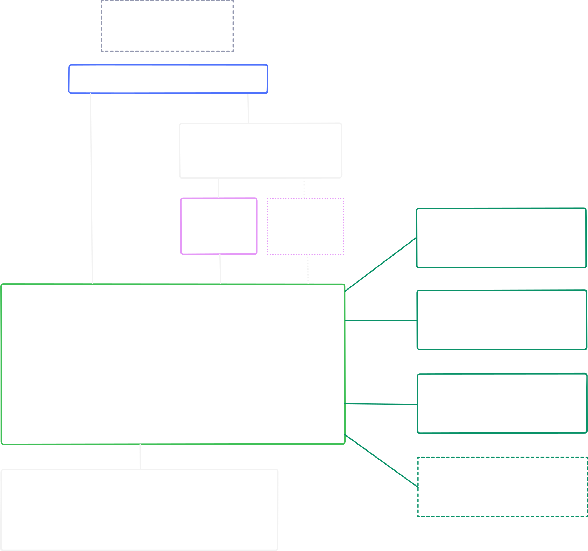
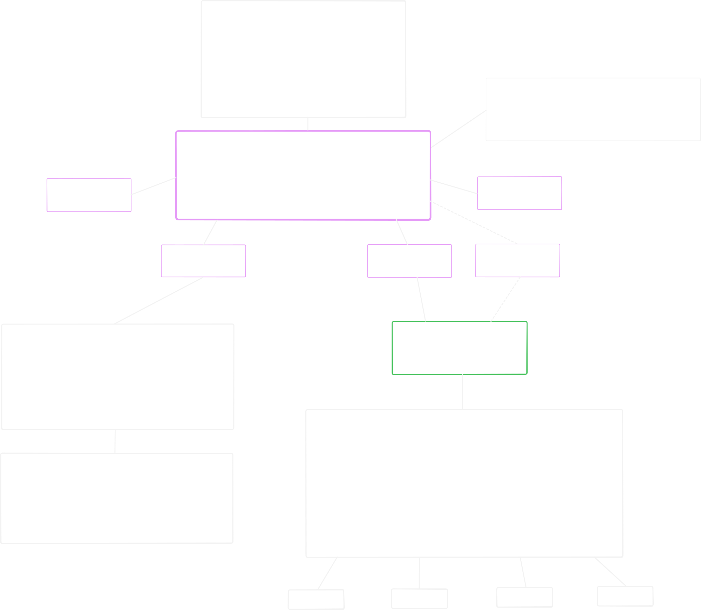
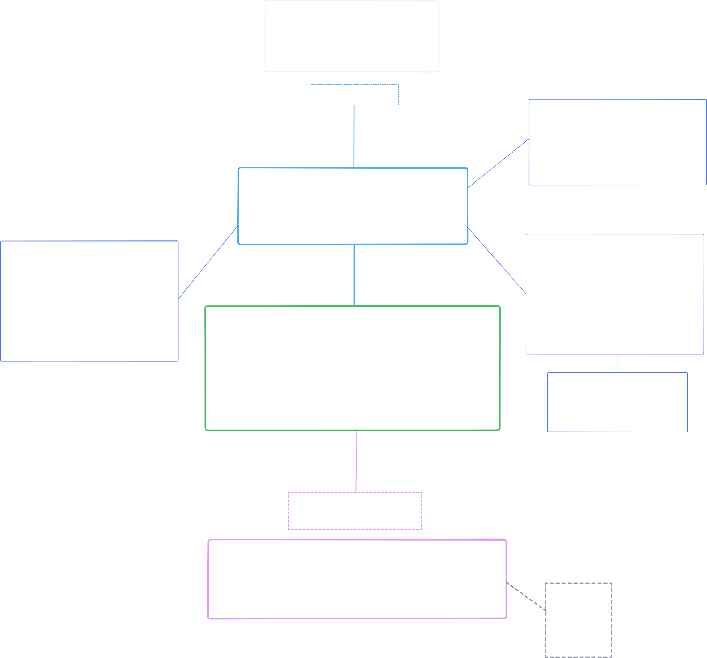

# Neovim Python IDE

Это пошаговая инструкция по сборке полноценной Python IDE на базе текстового редактора Neovim и конфигурационного фреймворка NvChad.
Задача этого руководства — собрать в одном документе полный, проверенный на практике путь от установки NvChad до получения рабочей Python IDE с отладчиком, линтерами и форматтерами, чтобы не пришлось собирать информацию из десятка разрозненных источников.

Проект состоит из пяти основных этапов:  
1. Установка и настройка NvChad.  
2. Установка инструментов разработчика.  
3. Установка дополнительных инструментов.  
4. Установка и настройка отладчика.  
5. Настройка pre-commit pipeline

А также включает подробку полезных и функциональных плагинов для повседневной работы.  

Результатом является полностью готовая к работе Python IDE с автодополнением, диагностикой кода, форматированием, пошаговой отладкой (Django, Flask, FastAPI), интеграцией с Git и набором инструментов для комфортной ежедневной разработки. 
В приложениях кратко описано, как устроены ключевые механизмы: подсветка синтаксиса, LSP, автодополнение и отладка, а так же приведены иллюстрации.

**Репозиторий содержит мои конфигурационные файлы `config/lua`, написанные в соответствии с этим руководством. Их можно использовать в качестве примеров или скопировать целиком.**

## Содержание

- [Часть 1: Установка и настройка NvChad](#часть-1-установка-и-настройка-nvchad)
    - [Установка NvChad](#установка-nvchad)
    - [Структура файлов NvChad](#структура-файлов-nvchad)
    - [Конфигурируем NvChad](#конфигурируем-nvchad)
- [Часть 2: Установка и настройка инструментов разработчика](#часть-2-установка-и-настройка-инструментов-разработчика)
    - [Treesitter](#treesitter)
    - [Установка pyright, ruff и black](#установка-pyright-ruff-и-black)
    - [Настройка pyright](#настройка-pyright)
    - [Настройка ruff](#настройка-ruff)
    - [Настройка black](#настройка-black)
- [Часть 3: Установка и настройка дополнительных инструментов](#часть-3-установка-и-настройка-дополнительных-инструментов)
    - [Список дополнительных инструментов](#список-дополнительных-инструментов)
    - [Установка](#установка)
- [Часть 4: Установка и настройка отладчика](#часть-4-установка-и-настройка-отладчика)
    - [Установка отладчика для python](#установка-отладчика-для-python)
    - [Установка и настройка необходимых плагинов](#установка-и-настройка-необходимых-плагинов)
- [Часть 5: Отладка](#часть-5-отладка)
    - [Управление отладчиком](#управление-отладчиком)
    - [Как отлаживать Django](#как-отлаживать-django)
    - [Как отлаживать Flask](#как-отлаживать-flask)
    - [Как отлаживать FastAPI](#как-отлаживать-fastapi)
- [Часть 6: Установка и настройка pre-commit pipeline](#часть-6-установка-и-настройка-pre-commit-pipeline)
- [Полезные плагины](#полезные-плагины)
- [Список использованных материалов](#список-использованных-материалов)

- [Приложение 1: Плагины NvChad по умолчанию](#приложение-1-плагины-nvchad-по-умолчанию)
- [Приложение 2: Как работает подсветка синтаксиса](#приложение-2-как-работает-подсветка-синтаксиса)
- [Приложение 3: Как работает LSP](#приложение-3-как-работает-lsp)
- [Приложение 4: Как работает автодополнение](#приложение-4-как-работает-автодополнение)
- [Приложение 5: Как работает отладка](#приложение-5-как-работает-отладка)

- [Tips and tricks](#tips-and-tricks)
    - [Подсветка строки с курсором](#подсветка-строки-с-курсором)
    - [Корректное определение типов файлов на примере docker-compose](#корректное-определение-типов-файлов-на-примере-docker-compose)

## Часть 1: Установка и настройка NvChad

Происходит в соответствии с официальной документацией NvChad.

### Установка NvChad

Перед установкой необходимо удалить предыдущие конфигурации Neovim и убедиться в наличии следующих зависимостей:

- `Nerd Font` - требует в качестве шрифтов терминала.
- `Tree-sitter-cli` — требуется для установки парсеров nvim-treesitter
- `Ripgrep` — для grep-поиска в Telescope
- `GCC` — для сборки native-расширений

Установка выполняется одной командой:
```bash
git clone https://github.com/NvChad/starter ~/.config/nvim && nvim
```

NvChad поставляется с предустановленным набором плагинов.   
Полный список плагинов по умолчанию с описанием представлен в разделе:  
[Плагины NvChad по умолчанию](#приложение-1-плагины-nvchad-по-умолчанию).  
После клонирования репозитория и запуска Neovim менеджер плагинов Lazy.nvim автоматически загрузит и установит все предустановленные плагины.  

**Важно:** чтобы LSP-серверы для Lua (lua-language-server, css-lsp, html-lsp) и форматтер stylua установились автоматически, перед выполнением следующих действий откройте любой Lua-файл — например, init.lua из директории `~/.config/nvim`.  

Для установки LSP-серверов и линтеров добавленных в конфигурацию по умолчанию, выполните в командном режиме:
```bash
:MasonInstallAll
```

После завершения установки удаляем директорию .git из ~/.config/nvim — репозиторий NvChad starter больше не нужен.

### Структура файлов NvChad


| Директория | Назначение |
|---|---|
| `~/.config/nvim/` | Пользовательские конфигурации — основная рабочая директория |
| `~/.local/share/nvim/` | Установленные плагины (Lazy, Mason) |
| `~/.local/state/nvim/` | Файлы состояния: история, undo, swap, логи |


### Конфигурируем NvChad

Основной файл конфигурации: `~/.config/nvim/lua/chadrc.lua`  

Получить полную справку по его структуре:
```bash
:h nvui
```

В `chadrc.lua` конфигурируются:

- Цветовая схема (раздел base46)
- Элементы пользовательского интерфейса:
    - Стиль окна автодополнения (cmp)
    - Стиль Telescope
    - Стиль statusline
    - Стиль tabufline
- Параметры плавающего терминала (раздел term)
- Приветственное окно (nvdash)
- Стиль cheatsheet
- Настройки `colorify.nvim` — отображение образцов цветов в буфере
- Пакеты Mason для автоматической установки

`hl_override и hl_add`  

Раздел `hl_override` в base46 полностью переопределяет стили для указанных `highlight-групп`.  
Раздел `hl_add` — дополняет существующие стили новыми, не заменяя их.  
Просмотреть доступные для переопределения группы можно командами:  
```bash
## список стандартных групп
:help highlight-groups
## текущие группы и их стили
:hi 
```

После внесения изменений в `chadrc.lua` выполнить для применения конфигурации:
```bash
:Lazy sync
:MasonInstallAll
```

## Часть 2: Установка и настройка инструментов разработчика

### Treesitter

Установка необходимых парсеров:
```bash
:TSInstall python requirements regex lua luap luau html css json jsonc bash markdown markdown_inline yaml toml dockerfile git_config git_rebase gitattributes gitcommit gitignore 
```

### Установка pyright, ruff и black

Добавить в `chadrc.lua`:  
```lua
M.mason = {
  pkgs = {
    ...
    "pyright",
    "ruff",
    "black",
  }
 ...
}
```

Выполнить:  
```bash
:MasonInstallAll
```

### Настройка pyright

Активация lsp-серверов с конфигом описана в [официальной документации NvChad](https://nvchad.com/docs/recipes).  

Cправка nvim-lspconfig:  
```bash
:help lspconfig 
:help lspconfig-all
```

Добавить в `configs/lspconfig.lua`:  
```lua
require("nvchad.configs.lspconfig").defaults()

local servers = {
  pyright = {
    settings = {
      python = {
        analysis = {
          -- Pyright сам ищет пути к библиотекам, установленным в виртуальном окружении
          autoSearchPaths = true,
          -- Строгость проверки типов: off/basic/strict - отключить / базовая (не требует аннотаций) / строгая (требует аннотаций)
          typeCheckingMode = "basic",
          -- Разрешить pyright заглядывать в код библиотек, а не только pyi-стабы - улучшает автодополнение и проверку типов, если стабы отсутствуют или не полны 
          useLibraryCodeForTypes = true,
          -- Режим диагностики -- openFilesOnly / workspace - анализируются только открытые файлы / все файлы в проекте 
          -- Проблемы всех файлов в проекте можно увидеть с помощью :Telescope diagnostics 
          -- А если включить Ruff и отключить диагностику у pyright совсем (off), то в :Telescope diagnostics можно увидеть диагностику ruff 
          diagnosticMode = "workspace",
        },
      },
    },
  },
}

for name, opts in pairs(servers) do
  vim.lsp.config(name, opts)
  vim.lsp.enable(name)
end
```

Проверить:   
```bash
:LspInfo
```

### Настройка ruff

Можно использовать ruff двумя способами:

1. Подключить как lsp-сервер

Добавить в `configs/lspconfig.lua`:  
```lua
local servers = {
  -- ...
  ruff = {},
}
...
```  
В этом случае, сообщения от ruff будут выводиться в neovim.

2. Вызывать в командной оболочке

В этом случае, если активно виртуальное окружение, то ruff придётся дополнительно устанавливать в виртуальное окружение (через pip) и вызывать оттуда.

Конфигурация пишется в `pyproject.toml`.  

### Настройка black

Установить black в качестве форматтера для python-кода в файле `configs/conform.lua`:  
```lua
local options = {
  formatters_by_ft = {
    lua = { "stylua" },
    python = { "black" },
    ...
  },
}
```

Lazy должен загружать плагин `conform.nvim` при открытии любого python-файла.  
Для этого добавить в `plugins/init.lua`:
```lua
{
    "stevearc/conform.nvim",
    -- загрузить conform при открытии или создании нового буфера 
    event = { "BufReadPre", "BufNewFile" },
    -- event = 'BufWritePre', -- uncomment for format on save
    opts = require "configs.conform",
},
```

Можно форматировать код тремя способами:

1. Автоматическое форматирование при сохранении.

В файле `configs/conform.lua` раскомментировать:  
```lua
local options = {...},

  format_on_save = {
    -- These options will be passed to conform.format()
    timeout_ms = 500,
    lsp_fallback = true,
  },
}
```

2. Форматирование специальной командой.

Описано в [официальной документации conform.nvim](https://github.com/stevearc/conform.nvim/blob/master/doc/recipes.md#format-command)

Для этого в `configs/conform.lua` добавить:
```lua
-- from conform.nvim github page #recipes
vim.api.nvim_create_user_command("ConformFormat", function(args)
  local range = nil
  if args.count ~= -1 then
    local end_line = vim.api.nvim_buf_get_lines(0, args.line2 - 1, args.line2, true)[1]
    range = {
      start = { args.line1, 0 },
      ["end"] = { args.line2, end_line:len() },
    }
  end
  require("conform").format({ async = true, lsp_format = "fallback", range = range })
end, { range = true })
```

Форматирование будет доступно по команде:  
```bash
:ConformFormat
```

3. Добавить комбинацию клавиш для форматирования

Добавить в `mappings.lua`:  
```lua
map("n", "<leader>fb", function()
  vim.cmd("ConformFormat")
end, { desc = "Format buffer with conform" })
```

Комбинация клавиш: `<leader> + fb`

Конфигурация пишется в `pyproject.toml`.  

## Часть 3: Установка и настройка дополнительных инструментов

### Список дополнительных инструментов

`taplo`  

Инструмент для комфортной работы с `*.toml` файлами.  
Работает как lsp-сервер, предоставляет: автодополнение, диагностику ошибок, навигацию, форматирование, валидацию toml по json schema.  

[taplo github page](github.com/tamasfe/taplo)

`yaml language server`

Инструмент для комфортной работы с `*.yaml` файлами.  
Работает как lsp-сервер, предоставляет: автодополнение, диагностику ошибок, hover-информацию, навигацию, форматирование, валидацию схем.  

[yaml-language-server github page](https://github.com/redhat-developer/yaml-language-server)

`docker language server`

Инструмент от Docker для работы с Dockerfile и Bake.  
Работает как lsp-сервер, предоставляет: автодополнение, диагностику ошибок, навигацию, форматирование и hover-информацию.  
Поддерживает линтинг для Dockerfile.  

[docker-language-server github page](https://github.com/docker/docker-language-server)

`dockerfmt`

Форматтер для Dockerfile.  
Он автоматически приводит Dockerfile к единому стилю: форматирует директивы, нормализует пробелы и форматирует shell-команды.  
Умеет преобразовывать устаревший синтаксис ENV.

[dockerfmt github page](https://github.com/reteps/dockerfmt)

### Установка  

Добавить в `chadrc.lua`:  
```lua
-- mason
...
M.mason = {
  pkgs = {
      ...
    "yaml-language-server",
    "taplo",
    "docker-language-server",
    "dockerfmt",
  }

```

Добавить в `configs/lspconfig.lua`:
```lua
require("nvchad.configs.lspconfig").defaults()

local servers = {
    ...
  yamlls = {
    filetypes = { "yaml", "yaml.docker-compose" },
  },
  taplo = {},
  docker_language_server = {},
}
...
```

Добавить в `configs/conform.lua`:
```lua
local options = {
    ...
    dockerfile = { "dockerfmt" },
}
```

Выполнить:  
```bash
:MasonInstallAll
```

## Часть 4: Установка и настройка отладчика

### Установка отладчика для python  

Добавить в `chadrc.lua`:  
```lua
...
M.mason = {
    ...
    "debugpy",
}
```

Выполнить:  
```bash 
:MasonInstallAll
```

### Установка и настройка необходимых плагинов

Описание плагинов, задействованных в работе с отладчиком можно посмотреть в [Приложение 5: Как работает отладка](#)

В директории `plugins` создать директорию `nvim-dap` со следующим содержимым:  
```text
plugins/
    ├── ...
    └── nvim-dap/
        ├── nvim-dap-keys.lua
        ├── nvim-dap-python/
        │   └── nvim-dap-python-keys.lua
        └── nvim-dap-ui/
            ├── nvim-dap-ui-config.lua
            └── nvim-dap-ui-keys.lua
```

В файл `plugins/init.lua` добавить:  
```lua
  {
    "mfussenegger/nvim-dap",
    ft = "python",
    dependencies = {
      {
        "rcarriga/nvim-dap-ui",
        opts = {},
        keys = require("plugins.nvim-dap.nvim-dap-ui.nvim-dap-ui-keys").keys,
        dependencies = { "nvim-neotest/nvim-nio" },
        config = function (_, opts)
          require("plugins.nvim-dap.nvim-dap-ui.nvim-dap-ui-config").setup(opts)
        end,
      },
      {
        "theHamsta/nvim-dap-virtual-text",
        opts = {},
      },
    },

    keys = require("plugins.nvim-dap.nvim-dap-keys").keys,

    config = function ()
      vim.api.nvim_set_hl(0, "DapStoppedLine", { default = true, link = "Visual" })
      local vscode = require("dap.ext.vscode")
      local json = require("plenary.json")
      vscode.json_decode = function(str)
        return vim.json.decode(json.json_strip_comments(str))
      end
    end,
  },

  {
    "mfussenegger/nvim-dap-python",
    ft = "python",
    keys = require("plugins.nvim-dap.nvim-dap-python.nvim-dap-python-keys").keys,

    config = function ()
      local python_path = vim.fn.stdpath("data") .. "/mason/packages/debugpy/venv/bin/python"
      require("dap-python").setup(python_path)
    end,
  },
```

В файл `nvim-dap/nvim-dap-keys.lua` добавить: 
```lua
local M = {}

M.keys = {
    { "<leader>dB", function() require("dap").set_breakpoint(vim.fn.input('Breakpoint condition: ')) end, desc = "Breakpoint Condition" },
    { "<leader>db", function() require("dap").toggle_breakpoint() end, desc = "Toggle Breakpoint" },
    { "<leader>dc", function() require("dap").continue() end, desc = "Run/Continue" },
    { "<leader>dC", function() require("dap").run_to_cursor() end, desc = "Run to Cursor" },
    { "<leader>dg", function() require("dap").goto_() end, desc = "Go to Line (No Execute)" },
    { "<leader>di", function() require("dap").step_into() end, desc = "Step Into" },
    { "<leader>dj", function() require("dap").down() end, desc = "Down" },
    { "<leader>dk", function() require("dap").up() end, desc = "Up" },
    { "<leader>dl", function() require("dap").run_last() end, desc = "Run Last" },
    { "<leader>do", function() require("dap").step_out() end, desc = "Step Out" },
    { "<leader>dO", function() require("dap").step_over() end, desc = "Step Over" },
    { "<leader>dP", function() require("dap").pause() end, desc = "Pause" },
    { "<leader>dr", function() require("dap").repl.toggle() end, desc = "Toggle REPL" },
    { "<leader>ds", function() require("dap").session() end, desc = "Session" },
    { "<leader>dt", function() require("dap").terminate() end, desc = "Terminate" },
    { "<leader>dw", function() require("dap.ui.widgets").hover() end, desc = "Widgets" },
}

return M
```

В файл `nvim-dap/nvim-dap-python/nvim-dap-python-keys.lua` добавить:  
```lua
local M = {}

M.keys = {
      { "<leader>dPt", function() require('dap-python').test_method() end, desc = "Debug Method", ft = "python" },
      { "<leader>dPc", function() require('dap-python').test_class() end, desc = "Debug Class", ft = "python" }
}

return M
```

В файл `nvim-dap/nvim-dap-ui/nvim-dap-ui-keys` добавить:  
```lua
local M = {}

M.keys = {
    { "<leader>du", function() require("dapui").toggle({ }) end, desc = "Dap UI" },
    { "<leader>de", function() require("dapui").eval() end, desc = "Eval", mode = {"n", "v"} },
}

return M
```

В файл `nvim-dap/nvim-dap-ui/nvim-dap-ui-config` добавить:  
```lua
local M = {}

function M.setup(opts)
    local dap = require("dap")

    dap.adapters.python = {
        type = 'executable';
        command = 'python';
        args = { '-m', 'debugpy.adapter' };
    }

    dap.configurations.python = {
        {
            type = 'python';
            request = 'launch';
            name = 'Start Django debugging';
            program = '/path/to/django/manage.py';
            args = {'runserver'};
            console = 'integratedTerminal';
            justMyCode = true;
        },
    }

    local dapui = require("dapui")
    dapui.setup(opts)
    dap.listeners.after.event_initialized["dapui_config"] = function()
        dapui.open({})
    end
    dap.listeners.before.event_terminated["dapui_config"] = function()
        dapui.close({})
    end
    dap.listeners.before.event_exited["dapui_config"] = function()
        dapui.close({})
    end
    vim.fn.sign_define('DapBreakpoint', {text='⬤', texthl='DapBreakpoint', linehl='', numhl=''})
    vim.cmd('highlight DapBreakpoint guifg=#FF0000 ctermfg=red')
end

return M
```

## Часть 5: Отладка

### Управление отладчиком

Основные команды отладки

| Комбинация | Команда DAP | Описание |
|---|---|---|
| `<leader>db` | `toggle_breakpoint()` | Включить / выключить точку останова |
| `<leader>dB` | `set_breakpoint(condition)` | Установить условную точку останова |
| `<leader>dc` | `continue()` | Запустить / продолжить выполнение |
| `<leader>dC` | `run_to_cursor()` | Выполнить до курсора |
| `<leader>di` | `step_into()` | Шаг внутрь функции |
| `<leader>dO` | `step_over()` | Шаг через (не заходя в функцию) |
| `<leader>do` | `step_out()` | Шаг наружу (до конца функции) |
| `<leader>dt` | `terminate()` | Завершить отладку |
| `<leader>dr` | `repl.toggle()` | Открыть / закрыть REPL-консоль |
| `<leader>dl` | `run_last()` | Повторить последний запуск |
| `<leader>dP` | `pause()` | Поставить выполнение на паузу |
| `<leader>dg` | `goto_()` | Перейти к строке (без выполнения) |
| `<leader>ds` | `session()` | Показать информацию о сессии |
| `<leader>dw` | `widgets.hover()` | Показать всплывающее окно с переменными |
| `<leader>dj` | `down()` | Вниз по call stack |
| `<leader>dk` | `up()` | Вверх по call stack |

Управление интерфейсом отладчика

| Комбинация | Команда DAP UI | Описание |
|---|---|---|
| `<leader>du` | `dapui.toggle()` | Открыть / закрыть панели отладки (переменные, стек вызовов, breakpoints) |
| `<leader>de` | `dapui.eval()` | Вычислить значение переменной под курсором (работает и в визуальном режиме) |


### Как отлаживать Django

Для отладки приложения на Django необходимо в файле `nvim-dap/nvim-dap-ui/nvim-dap-ui-config` прописать путь до файла manage.py приложения:  
```lua
dap.configurations.python = {
    {
        type = 'python';
        request = 'launch';
        name = 'Start Django debugging';
        program = '/path/to/django/manage.py';
        args = {'runserver'};
        console = 'integratedTerminal';
        justMyCode = true;
    },
}
```

### Как отлаживать Flask

Для отладки приложения на Flask необходимо в файле `nvim-dap/nvim-dap-ui/nvim-dap-ui-config` прописать путь до файла run.py приложения:  
```lua
dap.configurations.python = {
    {
        type = 'python';
        request = 'launch';
        name = 'Start Flask Debugging';
        program = '/path/to/run.py';
        args = {''};
        console = 'integratedTerminal';
        justMyCode = true;
    },
}
```

### Как отлаживать FastAPI

В конфигурациях для Django и Flask инициализируется переменная program, которая содержит путь до конкретного run.py, который запускает конкретное приложение.

В конфигурации для FastAPI вместо переменной program инициализируется переменная module, где указан uvicorn (ASGI для FastAPI), который запускается из текущего активного виртуального окружения.  
В аргументах args указывается 'src.main:app', то есть импорт-путь относительно корня проекта модуля main (main.py), который содержит переменную app (app = FastAPI()):  
```lua
dap.configurations.python = {
    {
        type = 'python',
        request = 'launch',
        name = 'Start FastAPI (uvicorn)',
        module = 'uvicorn',   -- вместо program используем module
        args = {
            'src.main:app',
            '--reload',
            -- '--port', '8000'
        },
        console = 'integratedTerminal',
        justMyCode = true,
    }
}
```

## Часть 6: Установка и настройка pre-commit

Pre-commit pipeline это набор автоматических проверок, которые запускаются перед созданием git commit для того, чтобы не дать попасть в репозиторий плохому коду.   
*Flow: git commit → pre-commit hooks → format/lint/type-check/tests → если всё OK → commit создаётся.*  

Установка (глобально):  
```bash
uv tool install pre-commit --with pre-commit-uv

```

Создать файл конфигурации `.pre-commit-config.yaml` (пример конфигурации):  
```yaml
repos:
  - repo: local
    hooks:
      - id: ruff
        name: ruff
        entry: ruff check --config pyproject.toml --output-format concise
        language: system
        types: [python]
        pass_filenames: true

      - id: black
        name: black
        entry: black --config pyproject.toml --check
        language: system
        types: [python]
        pass_filenames: true
```

Установить хук pre-commit в git:  
```bash
pre-commit install
```

Если нужно будет сделать commit несмотря на ошибки:  
```bash
git commit -m "info" --no-verify
```

## Полезные плагины

### AI-ассистент

`yetone/avante.nvim`

[avante github page](https://github.com/yetone/avante.nvim)

### Навигация и редактирование

`folke/flash.nvim`

Быстрые прыжки по тексту.  
Улучшенные motions f/t.  

[flash github page](https://github.com/folke/flash.nvim)

`kevinhwang91/nvim-ufo`

Улучшает встроенный folding.  

[neovim ufo github page](https://github.com/kevinhwang91/nvim-ufo)

`mg979/vim-visual-multi`

Полноценное multi-cursor редактирование.  
Одновременная работа с несколькими курсорами и выделениями.  

[vim-visual-multi github page](https://github.com/mg979/vim-visual-multi)

`hinell/duplicate.nvim`

Удобное дублирование строк и выделенных блоков.  

[duplicate github page](https://github.com/hinell/duplicate.nvim)

`fedepujol/move.nvim`

Перемещение строк и блоков с возможностью сохранения индентации.

[move github page](https://github.com/fedepujol/move.nvim)

### Уведомления и интерфейс

`folke/noice.nvim`

Заменяет стандартный UI для сообщений, командной строки и popup-меню:  

- Отображает уведомления с помощью notify.nvim  
- Позволяет гибко маршрутизировать сообщения от neovim и отображать их в разных представлениях  
- Ведёт историю сообщений  
- Добавляет UI для Command line  
- Добавляет UI для поиска  
- Добавляет UI для Hover-документации от LSP  
- Добавляет UI для LSP signature help  
- Подсвечивает синтаксис Vim/Lua прямо в Commad line  
- Отображает длинный вывод команд в обычных буферах/split  
- Подсвечивает синтаксис Vim/Lua прямо в Command line  

[noice github page](https://github.com/folke/noice.nvim)

`lukas-reineke/indent-blankline.nvim`

Подсветка направляющих отступов и вложенности.  
Улучшает читаемость кода.

[indent-blankline github page](https://github.com/lukas-reineke/indent-blankline.nvim)

`HiPhish/rainbow-delimiters.nvim`

Подсвечивает вложенные разделители, теги и ключевые слова разными цветами.  
Улучшает читаемость кода (особенно html и jsx).  

[rainbow-delimiters github page](https://github.com/hiphish/rainbow-delimiters.nvim)

`folke/todo-comments.nvim`

Подсвечивает теги комментариев (FIX, TODO, NOTE, PERF, HACK, WARNING).
Улучшает читаемость кода.

[todo-comments github page](https://github.com/folke/todo-comments.nvim)

`karb94/neoscroll`

Добавляет плавную анимацию прокрутки в Neovim вместо резких скачков при перемещении по файлу.  

[neoscroll github page](https://github.com/karb94/neoscroll.nvim)

`sphamba/smear-cursor.nvim`

Дополнительная анимация для курсора.  
Позволяет лучше замечать перемещения курсора.  

[smear-cursor github page](https://github.com/sphamba/smear-cursor.nvim)

`MeanderingProgrammer/render-markdown.nvim`

Рендеринг Markdown прямо в буфере Neovim.  

[render-markdown github page](https://github.com/MeanderingProgrammer/render-markdown.nvim)

### lsp интеграция

`nvimdev/lspsaga.nvim`

Улучшает встроенный LSP-интерфейс Neovim, предоставляя более удобный UI для навигации, диагностики, code actions и работы с символами:

- Показывает диагностику LSP в удобных float-окнах и позволяет быстро переходить между ошибками  
- Даёт Finder для поиска определений, ссылок и других LSP-символов  
- Добавляет Peek Definition / Peek Type Definition — просмотр определения прямо во всплывающем окне  
- Улучшает Hover — отображение документации и информации о символе  
- Добавляет удобный Rename с предварительным просмотром изменений и поиском/заменой по проекту  
- Показывает Code Actions в отдельном UI с live preview  
- Показывает Lightbulb при наличии доступных Code Actions  
- Добавляет Call Hierarchy — поиск входящих и исходящих вызовов  
- Показывает реализации интерфейсов и позволяет быстро переходить к ним  
- Добавляет Outline — дерево символов текущего файла  
- Добавляет Breadcrumbs — текущий путь по символам в winbar  
- Улучшает переходы Go to Definition / Type Definition визуальным beacon-индикатором  
- Добавляет float terminal  
- Предоставляет единый настраиваемый UI для LSP float-окон, границ, иконок и preview  

[lspsaga github page](https://github.com/nvimdev/lspsaga.nvim)

`folke/trouble.nvim`

Предоставляет единый удобный UI для диагностики и результатов LSP, Quickfix и Location List.  
Удобно для копирования сообщений lsp и линтера.

[trouble github page](https://github.com/folke/trouble.nvim)

### git интеграция

Git-клиент внутри Neovim

`NeogitOrg/neogit`

[neogit github page](https://github.com/NeogitOrg/neogit)

## Список использованных материалов

neovim: [neovim official website](https://neovim.io/)  
neovim: [neovim github page](https://github.com/neovim/neovim)  
  
nvchad: [nvchad official website](https://nvchad.com/)  
nvchad: [nvchad github page](https://github.com/NvChad/NvChad)  

dotfyle - discover neovim plugins: [dotfyle](https://dotfyle.com/)  

lazy: [lazy plugin manager docs](https://lazy.folke.io/)  
lazyvim: [lazyvim setup docs](https://www.lazyvim.org/)  

debugging guide: [guide to debugging in neovim](https://tamerlan.dev/a-guide-to-debugging-applications-in-neovim/)   
lazyvim dap spec: [lazyvim dap core specification](https://www.lazyvim.org/extras/dap/core)

## Приложение 1: Плагины NvChad по умолчанию

### Плагины NvChad

Базовые плагины фреймворка NvChad, обеспечивающие его работу, темы и пользовательские меню.


| Плагин | Описание | Ссылка |
|--------|----------|--------|
| nvchad/base46 | Движок тем NvChad: управление цветовыми схемами, переопределение highlight-групп, интеграции с плагинами | https://github.com/NvChad/base46 |
| nvchad/ui | UI-слой NvChad: statusline, tabufline (вкладки + буферы), cheatsheet, theme switcher, updater | https://github.com/NvChad/ui |
| nvzone/menu | Библиотека для создания всплывающих меню (используется minty и другими nvzone-плагинами) | https://github.com/nvzone/menu |
| nvzone/volt | Фреймворк для создания реактивных UI-компонентов внутри Neovim | https://github.com/nvzone/volt |
| nvzone/minty | Инструменты подбора и манипуляции цветом: команды Huefy и Shades | https://github.com/nvzone/minty |


### Плагины для автодополнения

Система автодополнения (completion) и всё, что с ней связано: движок сниппетов, источники, авто-закрытие скобок.


| Плагин | Описание | Ссылка |
|--------|----------|--------|
| hrsh7th/nvim-cmp | Основной фреймворк автодополнения (completion engine) | https://github.com/hrsh7th/nvim-cmp |
| L3MON4D3/LuaSnip | Движок сниппетов с поддержкой сложных преобразований | https://github.com/L3MON4D3/LuaSnip |
| rafamadriz/friendly-snippets | Коллекция готовых сниппетов для множества языков и фреймворков | https://github.com/rafamadriz/friendly-snippets |
| windwp/nvim-autopairs | Автоматическое закрытие скобок, кавычек и других парных символов | https://github.com/windwp/nvim-autopairs |
| saadparwaiz1/cmp_luasnip | Источник сниппетов LuaSnip для nvim-cmp | https://github.com/saadparwaiz1/cmp_luasnip |
| hrsh7th/cmp-nvim-lua | Источник API Neovim Lua для nvim-cmp | https://github.com/hrsh7th/cmp-nvim-lua |
| hrsh7th/cmp-nvim-lsp | Источник LSP-завершений для nvim-cmp | https://github.com/hrsh7th/cmp-nvim-lsp |
| hrsh7th/cmp-buffer | Источник завершений из содержимого открытых буферов для nvim-cmp | https://github.com/hrsh7th/cmp-buffer |
| FelipeLema/cmp-async-path | Источник путей файловой системы для nvim-cmp | https://codeberg.org/FelipeLema/cmp-async-path |


### User Interface плагины

Плагины, отвечающие за визуальное оформление, навигацию и отображение информации.


| Плагин | Описание | Ссылка |
|--------|----------|--------|
| nvim-tree/nvim-web-devicons | Набор иконок для типов файлов (используется nvim-tree, telescope и др.) | https://github.com/nvim-tree/nvim-web-devicons |
| nvim-tree/nvim-tree.lua | Файловый менеджер в виде дерева директорий | https://github.com/nvim-tree/nvim-tree.lua |
| folke/which-key.nvim | Всплывающая подсказка по доступным хоткеям при нажатии лидера | https://github.com/folke/which-key.nvim |
| lukas-reineke/indent-blankline.nvim | Вертикальные линии отступов (indent guides) и подсветка scope-блоков | https://github.com/lukas-reineke/indent-blankline.nvim |


### Инструменты 

Инструменты для разработки: LSP, форматирование, подсветка синтаксиса.


| Плагин | Описание | Ссылка |
|--------|----------|--------|
| mason-org/mason.nvim | Менеджер внешних инструментов: LSP-серверы, DAP-адаптеры, линтеры, форматтеры | https://github.com/mason-org/mason.nvim |
| neovim/nvim-lspconfig | Стандартная конфигурация LSP-серверов для Neovim | https://github.com/neovim/nvim-lspconfig |
| stevearc/conform.nvim | Форматирование кода с поддержкой множества форматтеров и LSP-fallback | https://github.com/stevearc/conform.nvim |
| nvim-treesitter/nvim-treesitter | Синтаксический парсер: улучшенная подсветка, навигация по AST, инкрементальный выбор | https://github.com/nvim-treesitter/nvim-treesitter |


### Другое 

Плагины общего назначения, не вошедшие в предыдущие категории.


| Плагин | Описание | Ссылка |
|--------|----------|--------|
| nvim-lua/plenary.nvim | Набор Lua-утилит (JSON, Path, async-операции, job control) — зависимость многих плагинов | https://github.com/nvim-lua/plenary.nvim |
| nvim-telescope/telescope.nvim | Универсальный fuzzy-поиск: файлы, grep, diagnostics, git, LSP и сотни расширений | https://github.com/nvim-telescope/telescope.nvim |
| lewis6991/gitsigns.nvim | Git-значки в gutter-колонке: добавлено, изменено, удалено, blame, hunk-навигация | https://github.com/lewis6991/gitsigns.nvim |


## Приложение 2: Как работает подсветка синтаксиса

В современных версиях neovim движок tree-sitter встроен в neovim.  
Плагин `nvim-treesitter.nvim` - это надстройка, которая устанавливает парсеры и поставляет файлы запросов.  
Саму подсветку выполняет встроенный движок tree-sitter.  

Работает примерно так:

1. Определение filetype (*.py, *.html, etc).  
2. Включение подсветки (включается tree-sitter подсветка для буфера).  
3. Поиск парсера (neovim проверяет установлен ли для этого языка парсер).  
4. Построение дерева (если парсер найден, движок tree-sitter строит AST - синтаксическое дерево).  
5. Применение запросов (подбирается файл запроса: такой файл описывает, каким узлам дерева какая синтаксическая роль соответствует. движок tree-sitter помечает узлы специальными именами).  
6. Раскраска (эти имена и есть группы подвестки highlight groups. neovim берёт для них цвета, заданные текущей цветовой схемой).  

## Приложение 3: Как работает LSP 

Language Server Protocol (LSP) — это протокол обмена данными между LSP-клиентом и LSP-сервером.  

LSP-клиент встроен в сам Neovim. LSP-серверы, специфичные для каждого языка программирования или разметки, устанавливаются отдельно — в нашем случае через Mason.  

LSP-сервер может поддерживать автодополнение кода, диагностику, переход к определению (go to definition), подсветку семантических элементов и другие возможности. Функциональность у разных LSP-серверов разная: один сервер может уметь всё перечисленное, другой — только часть.  

Встроенному LSP-клиенту для запуска конкретного сервера нужна конфигурация: как его запустить, в какой директории проекта работать, какие настройки ему передать.  
Писать это вручную для каждого сервера неудобно, поэтому используется плагин nvim-lspconfig — он не запускает серверы сам, а просто хранит готовые конфигурации для множества известных LSP-серверов и документацию по ним.  
Neovim использует эти конфигурации, а запускает и поддерживает соединение с сервером уже сам, силами встроенного LSP-клиента.



## Приложение 4: Как работает автодополнение

С автодополнением дело обстоит немного сложнее. У встроенного LSP-клиента есть базовая поддержка автодополнения, но её интерфейс скромный.  
Поэтому обычно используют отдельный плагин — nvim-cmp. Это универсальный движок автодополнения: сам по себе он не знает ни про LSP, ни про буфер, ни про пути к файлам — он умеет только показывать всплывающее меню, сортировать и фильтровать варианты.  
Все конкретные подсказки ему поставляют отдельные плагины-источники (sources), каждый из которых отвечает за свой тип данных:

- cmp-nvim-lsp — источник, который запрашивает варианты у LSP-сервера через встроенный LSP-клиент и передаёт их в nvim-cmp;
- cmp-buffer — предлагает слова, уже встречающиеся в открытых буферах;
- cmp-path — предлагает пути к файлам;
- cmp-nvim-lua — предлагает элементы Lua API самого Neovim (vim.api, vim.lsp.util и т.д.). это отдельный статический источник, никак не связанный с LSP-сервером lua-language-server — он полезен именно при редактировании конфигов Neovim на Lua;
- и другие — под сниппеты, историю буфера обмена и так далее.

Остальные возможности LSP — диагностика, переход к определению, hover-подсказки и подобное — nvim-cmp не касаются.  
Их встроенный LSP-клиент реализует сам, напрямую через Neovim API (vim.lsp.buf.*, знаки на полях, floating-окна, quickfix-список), без участия сторонних плагинов автодополнения.



## Приложение 5: Как работает отладка

### Протокол DAP

DAP (Debug Adapter Protocol) - это спецификация, описывающая формат общения между клиентом-редактором и отладчиком (точнее — debug-адаптером, программой-посредником, которая говорит на DAP и управляет реальным отладчиком под капотом).

В отличие от LSP, поддержка DAP не встроена в Neovim: своего DAP-клиента у редактора нет.  
Эту роль берёт на себя плагин nvim-dap — он реализует протокол DAP и выступает клиентом для Neovim.

### Как это работает на примере Python

Сам процесс отладки Python-кода ведёт программа debugpy — она выступает debug-адаптером, то есть той стороной, которая понимает DAP-команды от nvim-dap и превращает их в реальные действия над отлаживаемым процессом.  
Схема:  
*Neovim (nvim-dap) → по протоколу DAP → debugpy (debug-адаптер) → управляет → отлаживаемый Python-процесс*  

1. Neovim через nvim-dap отправляет debugpy команды: поставить точку останова, начать выполнение, сделать шаг и так далее.  
2. Debugpy запускает отлаживаемый файл нужным интерпретатором Python — это не обязательно системный интерпретатор, часто указывают путь к интерпретатору из virtualenv/venv.  
3. Управляет самим выполнением программы (установка точек останова, пошаговое выполнение, чтение состояния переменных) debugpy не напрямую, а через встроенную в него библиотеку pydevd — именно она вклинивается в выполнение Python-кода на низком уровне.  
4.  Результаты (текущая строка, стек вызовов, значения переменных) идут в обратном направлении: pydevd → debugpy → nvim-dap → Neovim.  

### Дополнительные зависимости

Сам nvim-dap отвечает только за протокол и базовое управление сессией — у него нет ни готового интерфейса, ни настроек под конкретные языки «из коробки».  
Поэтому в связке с ним используют плагины-надстройки:  

- nvim-dap-ui — графический интерфейс для nvim-dap: панели со стеком вызовов, переменными, точками останова, консолью (REPL) и т.д.  
- nvim-dap-virtual-text — показывает значения переменных прямо рядом с кодом, используя тот же механизм virtual text (extmarks), что и подсказки LSP-сервера.  
- nvim-nio — библиотека для асинхронного ввода-вывода, зависимость nvim-dap-ui.  
- nvim-dap-python — берёт на себя настройку nvim-dap специально под debugpy: не нужно вручную прописывать adapter и configuration для Python.  



## Tips and tricks

### Подсветка строки с курсором

Раскомментировать в `options.lua`:  
```lua 
require "nvchad.options"

local o = vim.o

-- enable cursorline
o.cursorlineopt ='both'
```

Цвет подсветки устанавливается в `chadrc.lua`:  
```lua
hl_override = {
    ...
    CursorLine = { bg = "#343b49" },
}
```

### Корректное определение типов файлов на примере docker-compose

Как распознаётся тип текущего файла:
```bash
:set filetype?
```

Создать файл filetypes.lua в `~/.config/nvim/lua/`:  

```lua
vim.filetype.add({
  filename = {
    ["docker-compose.yml"] = "yaml.docker-compose",
    ["docker-compose.yaml"] = "yaml.docker-compose",
    ["compose.yml"] = "yaml.docker-compose",
    ["compose.yaml"] = "yaml.docker-compose",
  },
})
```

Добавить в `init.lua`:  
```lua
...
require "filetypes"
...
```

Перепроверить `filetype?`

